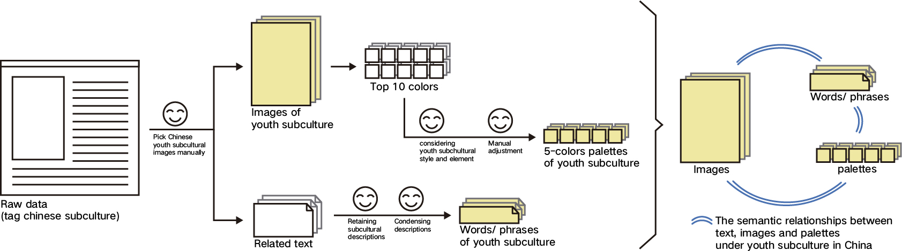
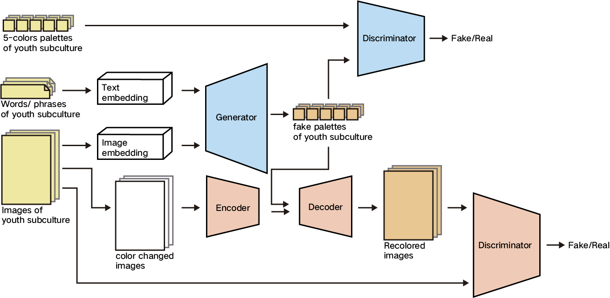
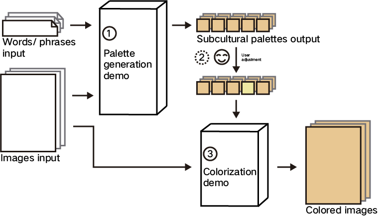

# Subculture-Palette
#### Palette Generation and Colorization for Youth Subculture in China

This project includes **1 dataset** (image-palette-text dataset for youth subculture in China) and **2 jupyter notebook file** (one for subcultural palette generation and another one for colorization).


## Image-palette-text dataset for youth subculture in China


This dataset is for youth subculture in China. It contains of images, palettes and text. Find the dataset in the folder :

    './dataset'


### images:

We collected 685 high-quality images under youth subculture in China. The url of these images are recorded in 

    ./dataset/url_text.csv

Or you can directly download them from the baidu_disk link below:

    https://pan.baidu.com/s/1xjUT_hwGuD6Bv1srYddkWw  password:tgfw 


### text:

The text includes words and phrases, which refinedly describe the subcultural style/feelings conveyed by the images. The words and phrases are recorded in the file 

    ./dataset/url_text.csv.

### palettes:
We built subcultural palette for every image in the dataset. Each palette contains of 5 colors. The HEX values of these palettes are recorded in the file 

    ./dataset/palette.csv.   
Besides, we also recorded the position number where the colors in the subculture palettes appear in the top ten colors used in the image.

All the csv files are encoded with utf-8.

#### Building process of the dataset:




## Framework: palette generation and colorization



There are two main model in this framework: palette generation model and colorization model.   
The palettes, words/phrase, images from the dataset as the input data enter into the first model. Through the palette generation cGAN(illustrated in blue boxes), fake palettes of youth subculture are generated. Then the fake palettes and the original images that are changed color are as the input of the colorization model. Through the encoder, decoder and discriminator(illustrated in pink boxes), recolored images are generated.

### train:

    run palette_gen_training.ipynb

    run colorization.ipynb


### download trained model:
palette_gen_ckpt: 

    https://pan.baidu.com/s/1nVaHHatNDkekZ4QFhU6McA password: min7 

colorization_ckpt: 

    https://pan.baidu.com/s/1yvJfDPZuwMsy498bSNvzew password: e8hx


## Demo



### run demo:
 ```python
streamlit run demo.py
 ```

