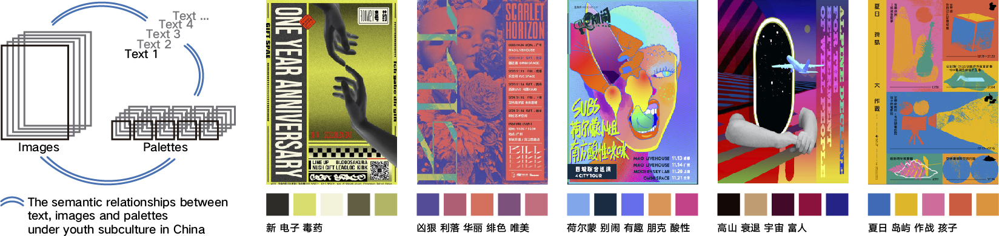

# dataset
This dataset is for youth subculture in China. It contains of images, palettes and text. 

## images:

We collected 685 high-quality images under youth subculture in China. The url of these images are recorded in url_text.csv. Or you can directly download them from the baidu_disk link below:

https://pan.baidu.com/s/1xjUT_hwGuD6Bv1srYddkWw  password:tgfw 

## text:

The text includes words and phrases, which refinedly describe the subcultural style/feelings conveyed by the images. The words and phrases are recorded in the file url_text.csv.

## palettes:
We built subcultural palette for every image in the dataset. Each palette contains of 5 colors. The HEX values of these palettes are recorded in the file palette.csv. 
Besides, we also recorded the position number where the colors in the subculture palettes appear in the top ten colors used in the image.

all the csv files are encoded with utf-8.